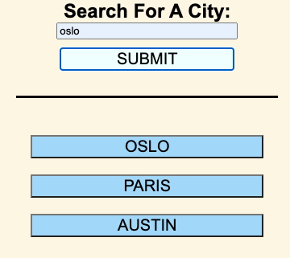
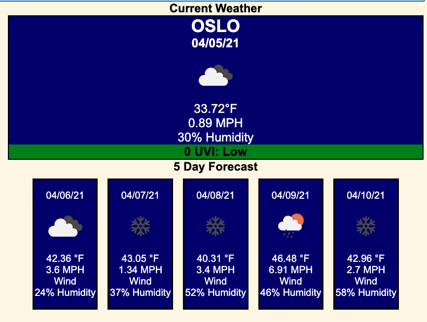
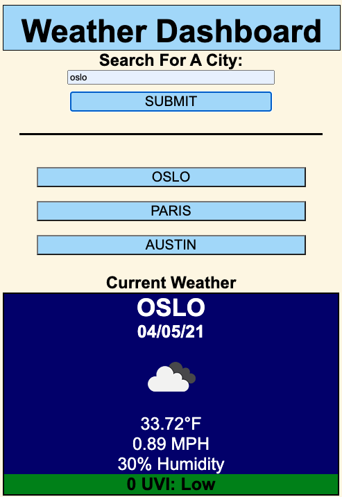
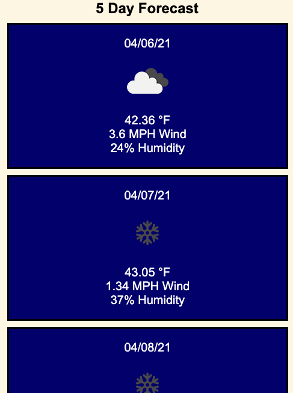
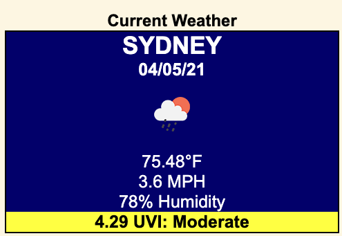
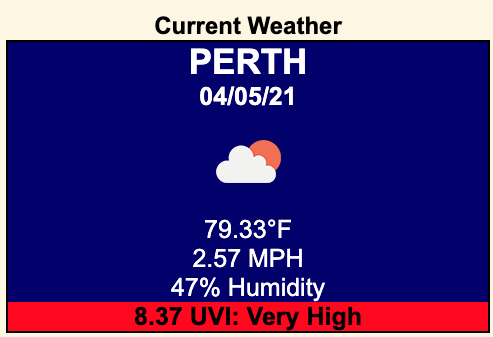

# Weather Dashboard

This week's assignment was to build a weather dashboard. Our dashboard's data was colleced from a third-party API. 

1.Search Column

The search column is made up of a search bar and dynamic buttons. The search bar will allow user to search the weather in different cities. If the entry is blank or the city doesn't exist in the API, the button will do nothing. If the city exists it will display in the weather column and populate a dynamic button to the lists of previous searches. If the city has been searched before, the weather will display but no additional buttons will be added to the search column. 

2.Weather Column

The weather column is made up of the current weather and the 5 day forecast. The weather is defaulted to Austin when the page first loads. The current weather features temperature, windspeed, humidity, and the UV index. The 5-day forecast consists of the weather for the next 5 days including temperature, wind, and humidity. 

3.Dynamic screen will change arrangement of layout when the size of the screen is smaller or mobile.

4.UVI will change color based on the level. Green for low, yellow for moderate, orange for high, and red for very high.

